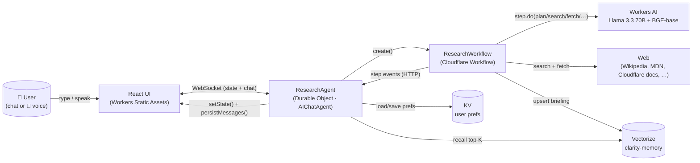
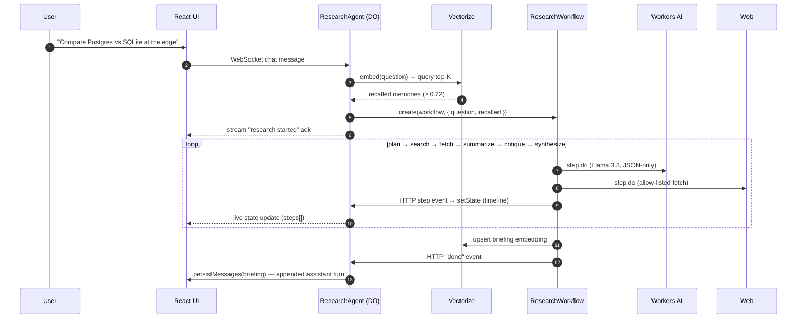

# cf_ai_clarity

> A stateful AI research & briefing agent built on Cloudflare. Ask a question by chat or
> voice; Clarity plans a multi-step research pipeline, runs it durably as a Cloudflare
> Workflow, and returns a cited briefing. It remembers prior briefings semantically — ask
> a related question next week and it pulls in relevant context from past sessions.

Built for the Cloudflare Internship AI assignment. Repository name is prefixed with
`cf_ai_` per the assignment requirements.

---

## Required components → where they live

| Required component                 | Implementation                                                                                              | File(s)                                                                                                                                                                                                                                                          |
| ---------------------------------- | ----------------------------------------------------------------------------------------------------------- | ---------------------------------------------------------------------------------------------------------------------------------------------------------------------------------------------------------------------------------------------------------------- |
| **LLM**                            | Llama 3.3 70B Instruct on Workers AI (with automatic fallback to Llama 3.1 8B)                              | [`src/server/tools/llm.ts`](src/server/tools/llm.ts), `wrangler.jsonc` (AI binding + `PRIMARY_MODEL` / `FALLBACK_MODEL`)                                                                                                                                          |
| **Workflow / coordination**        | Cloudflare **Workflow** (`cloudflare:workers`) orchestrating plan → search → fetch → summarize → critique → synthesize, plus a **Durable Object**–backed Agent that owns per-session state | [`src/server/workflow.ts`](src/server/workflow.ts), [`src/server/agent.ts`](src/server/agent.ts)                                                                                                                                                                  |
| **User input (chat & voice)**      | React + Vite UI served via Workers Static Assets (Pages-style); Web Speech API for in-browser STT and optional TTS playback                                                          | [`src/client/App.tsx`](src/client/App.tsx), [`src/client/components/ChatPane.tsx`](src/client/components/ChatPane.tsx), [`src/client/components/VoiceInput.tsx`](src/client/components/VoiceInput.tsx), [`src/client/hooks/useVoice.ts`](src/client/hooks/useVoice.ts) |
| **Memory / state**                 | Per-session SQL store (built into AIChatAgent) + long-term semantic memory in **Vectorize** (BGE embeddings) + Workers **KV** for user preferences                                  | [`src/server/memory/vectorize.ts`](src/server/memory/vectorize.ts), [`src/server/memory/kv.ts`](src/server/memory/kv.ts), [`src/server/tools/memory-store.ts`](src/server/tools/memory-store.ts), [`src/server/tools/memory-recall.ts`](src/server/tools/memory-recall.ts) |

---

## Architecture



### Sequence — one research run



### Pipeline stages

| Stage          | What it does                                                                                       | Module                                                                                                                |
| -------------- | -------------------------------------------------------------------------------------------------- | --------------------------------------------------------------------------------------------------------------------- |
| **plan**       | Llama produces a JSON plan (`topic`, `questions`, `queries`, `expectedAngles`)                     | [`prompts/planner.ts`](src/server/prompts/planner.ts)                                                                 |
| **search**     | Brave Search (when `BRAVE_API_KEY` set) or DuckDuckGo HTML scrape; allow-listed hosts only         | [`tools/web-search.ts`](src/server/tools/web-search.ts)                                                               |
| **fetch**      | Fetch + readability-style text extraction; auto-approval gated by `AUTO_APPROVE_FETCH` env var     | [`tools/web-fetch.ts`](src/server/tools/web-fetch.ts)                                                                 |
| **summarize**  | Per-source summary (`bullets`, `relevance ∈ [0,1]`); only `relevance ≥ 0.3` reach synthesis        | [`prompts/summarizer.ts`](src/server/prompts/summarizer.ts)                                                           |
| **critique**   | Independent pass that flags unsupported claims and source conflicts; sets confidence ceiling       | [`prompts/critic.ts`](src/server/prompts/critic.ts)                                                                   |
| **synthesize** | Cited briefing in JSON, downgraded by critique confidence; bullets carry inline `[n]` citations    | [`prompts/synthesizer.ts`](src/server/prompts/synthesizer.ts), [`format.ts`](src/server/format.ts)                    |
| **persist**    | Embed `(question + summary)` and upsert to Vectorize with `{ sessionId, ts, topic }`               | [`tools/memory-store.ts`](src/server/tools/memory-store.ts), [`memory/vectorize.ts`](src/server/memory/vectorize.ts) |

Every step uses `step.do` with `retries: { limit: 2, backoff: "exponential" }` so the
workflow is durable across DO restarts and transient AI errors. A `step.sleep`
between fetch and summarize keeps Workers AI rate-limit pressure low.

---

## Quick start

### Prerequisites

- Node.js ≥ 20
- A Cloudflare account (free tier is fine for everything used here)
- `wrangler` (installed locally as a dev dep — no global install needed)

### Local dev

```bash
git clone <your-clone-url> cf_ai_clarity
cd cf_ai_clarity
npm install
```

Authenticate Wrangler and create the Vectorize index + KV namespace once:

```bash
npx wrangler login
npm run setup:vectorize
```

`setup:vectorize` runs `wrangler vectorize create clarity-memory --dimensions=768 --metric=cosine`
and `wrangler kv namespace create clarity-prefs`. Copy the printed KV namespace ID into
`wrangler.jsonc → kv_namespaces[0].id`.

Then start the dev server:

```bash
npm run dev
```

Wrangler serves both the Worker and the bundled Vite client at `http://localhost:8787`.
Open it, type a question, or click the microphone to speak. The right-hand panel shows
the live workflow timeline and any memories recalled from prior sessions.

### Deploy

```bash
npm run deploy        # vite build && wrangler deploy
```

### Dry-run (no Cloudflare auth needed)

```bash
npm run deploy:dry    # vite build && wrangler deploy --dry-run
```

This validates the bundle, all bindings, and all migrations without touching your
account.

---

## Bindings (the exact `wrangler.jsonc` shape)

```jsonc
{
  "name": "cf-ai-clarity",
  "main": "src/server/index.ts",
  "compatibility_date": "2026-04-01",
  "compatibility_flags": ["nodejs_compat"],

  "assets": { "directory": "./dist", "binding": "ASSETS", "not_found_handling": "single-page-application" },
  "ai": { "binding": "AI" },

  "vectorize":  [{ "binding": "MEMORY_INDEX", "index_name": "clarity-memory" }],
  "kv_namespaces": [{ "binding": "PREFS", "id": "<paste-from-setup:vectorize>" }],

  "durable_objects": { "bindings": [{ "name": "ResearchAgent", "class_name": "ResearchAgent" }] },
  "workflows":       [{ "binding": "RESEARCH_WORKFLOW", "name": "clarity-research-workflow", "class_name": "ResearchWorkflow" }],

  "migrations": [{ "tag": "v1", "new_sqlite_classes": ["ResearchAgent"] }]
}
```

`new_sqlite_classes` (not `new_classes`) is required — `AIChatAgent` uses SQLite for
message persistence and resumable streams.

---

## Environment variables / secrets

| Name                       | Where           | Purpose                                                                              | Default                                  |
| -------------------------- | --------------- | ------------------------------------------------------------------------------------ | ---------------------------------------- |
| `PRIMARY_MODEL`            | `vars`          | Workers AI model used for all reasoning steps                                        | `@cf/meta/llama-3.3-70b-instruct-fp8-fast` |
| `FALLBACK_MODEL`           | `vars`          | Used automatically when the primary call throws                                      | `@cf/meta/llama-3.1-8b-instruct`         |
| `EMBEDDING_MODEL`          | `vars`          | BGE-base for memory embeddings                                                       | `@cf/baai/bge-base-en-v1.5`              |
| `AUTO_APPROVE_FETCH`       | `vars`          | When `"true"`, skips the human-in-the-loop fetch gate (used in dev/prod here)        | `true`                                   |
| `FETCH_ALLOWLIST`          | `vars`          | Comma-separated host suffixes the fetch tool may hit                                 | wikipedia, MDN, Cloudflare docs, etc.    |
| `MEMORY_RECALL_THRESHOLD`  | `vars`          | Cosine similarity floor for recalled memories                                        | `0.72`                                   |
| `MEMORY_RECALL_TOPK`       | `vars`          | Top-K memories considered each turn                                                  | `5`                                      |
| `BRAVE_API_KEY`            | secret (opt.)   | Use Brave Search instead of DuckDuckGo HTML scraping (more reliable)                 | unset                                    |
| `OPENAI_API_KEY`           | secret (opt.)   | Reserved for swapping in OpenAI as the primary LLM provider                          | unset                                    |
| `ANTHROPIC_API_KEY`        | secret (opt.)   | Reserved for swapping in Anthropic as the primary LLM provider                       | unset                                    |

Set secrets with `npx wrangler secret put BRAVE_API_KEY` (etc.). Do **not** put secrets
in `wrangler.jsonc`.

---

## Scripts

| Script                | What it does                                                            |
| --------------------- | ----------------------------------------------------------------------- |
| `npm run dev`         | Wrangler dev (Worker + bundled assets) on `http://localhost:8787`       |
| `npm run build`       | Vite build → `dist/`                                                    |
| `npm run deploy`      | Build then `wrangler deploy`                                            |
| `npm run deploy:dry`  | Build then `wrangler deploy --dry-run` (no auth needed)                 |
| `npm run setup:vectorize` | One-time Vectorize + KV provisioning                                |
| `npm run typecheck`   | `tsc --noEmit` (strict mode, `noUncheckedIndexedAccess`)                |
| `npm run lint`        | `eslint .` (no `any`, react-hooks rules)                                |
| `npm test`            | `vitest run`                                                            |
| `npm test -- --coverage` | Vitest with V8 coverage (90%+ statements on covered modules)         |
| `npm run format`      | Prettier write                                                          |

---

## Code map

```text
src/
  server/
    index.ts            # Worker fetch entry + /api routes; routes /agents/* via routeAgentRequest
    agent.ts            # ResearchAgent extends AIChatAgent — chat surface + workflow event sink
    workflow.ts         # ResearchWorkflow — durable plan → search → fetch → summarize → critique → synthesize
    format.ts           # Briefing → markdown formatter (pure)
    types.ts            # Env, AgentState, ResearchStep, CitedBriefing, …
    tools/
      llm.ts            # Workers AI runner with automatic fallback model
      web-search.ts     # Brave Search → DuckDuckGo HTML fallback
      web-fetch.ts      # Allow-listed fetch + readability extraction (timeout, byte cap)
      memory-recall.ts  # Vectorize query (top-K + threshold)
      memory-store.ts   # Embed (question+summary) and upsert to Vectorize
    memory/
      vectorize.ts      # embed() / upsert() / query() helpers
      kv.ts             # Zod-validated user prefs in Workers KV
    prompts/
      planner.ts        # JSON plan + parser
      synthesizer.ts    # JSON cited briefing + parser
      critic.ts         # JSON critique + parser
      summarizer.ts     # JSON per-source summary + parser
      intent.ts         # chitchat vs research classifier (LLM + heuristic fallback)
  client/
    main.tsx            # React 19 entry
    App.tsx             # useAgent + useAgentChat wiring; state sync; TTS hookup
    components/
      ChatPane.tsx      # message list + composer with Enter-to-send and lightweight markdown
      VoiceInput.tsx    # mic button + interim-transcript display
      WorkflowTimeline.tsx  # live step status driven by agent state
      MemoryPanel.tsx   # recalled prior briefings with similarity scores
    hooks/
      useVoice.ts       # Web Speech API wrapper (STT) + speechSynthesis (TTS)
tests/
  prompts.test.ts        # planner / synthesizer / critic / summarizer / intent parsers
  parsers-extra.test.ts  # parser edge cases (fences, prose-wrapped, malformed)
  web-search.test.ts     # DuckDuckGo HTML parser
  web-search-fetch.test.ts  # fetch-mocked end-to-end search + fetch
  web-fetch.test.ts      # allowlist + readability extraction
  llm.test.ts            # Workers AI fallback semantics
  workflow-step.test.ts  # mocked-AI test for plan + summarize steps
  memory.test.ts         # KV prefs schema
  kv-prefs.test.ts       # KV mock round-trip
  agent.test.ts          # formatBriefing markdown
```

---

## Demo

> **Note:** Record a 30s GIF the first time you run the agent and place it at
> `docs/demo.gif`. The README links it here once present.

`docs/demo.gif` *(record locally — typing a research question, watching the timeline tick, then a follow-up to demonstrate semantic recall)*

---

## What I'd do next

- **Cloudflare Browser Rendering** for fetch — replaces the manual readability heuristic
  with a real headless browser, handling client-rendered pages and PDFs correctly.
- **AI Gateway** in front of the AI binding — caching, retries, model fallbacks, and
  per-session rate limits centralised at the gateway, not the app.
- **Server-side tools exposed via MCP** — `agents/mcp` lets us expose `memory-recall`
  and `memory-store` to other agents and IDEs as MCP tools.
- **Sub-agents per topic** — long-running follow-up agents that watch a topic over time
  and proactively notify when a key claim changes (the Agents SDK supports this via
  `sub` agents and `scheduleEvery`).
- **Real human-in-the-loop fetch gate** — flip `AUTO_APPROVE_FETCH=false` and surface
  the approval as a chat-side tool-call card via `useAgentChat`'s `onToolCall`.
- **Eval harness** — golden-set of 20 research questions with expected citations and
  confidence; run nightly via Workflows on a cron.

---

## Known limitations

- **DuckDuckGo HTML fallback is rate-limited.** Set `BRAVE_API_KEY` via
  `wrangler secret put BRAVE_API_KEY` for reliable production use.
- **Fetch is allow-listed.** The default allowlist (Wikipedia, MDN, Cloudflare docs,
  arxiv, GitHub, Stack Overflow, …) is intentionally narrow. Add hosts via
  `FETCH_ALLOWLIST` in `wrangler.jsonc`.
- **Voice input requires a Chromium-based browser.** Web Speech API is not implemented
  in Firefox; the mic button is disabled with a tooltip explaining this. TTS works
  everywhere `speechSynthesis` is available.
- **Llama 3.3 70B can occasionally emit non-JSON.** Each parser uses a strict-then-loose
  recovery (try-parse → match `{...}` and try again) and we always fall back to
  Llama 3.1 8B if the primary call throws. If both fail, the workflow surfaces a
  meaningful error in the timeline rather than silently swallowing it.

---

## License

MIT.
